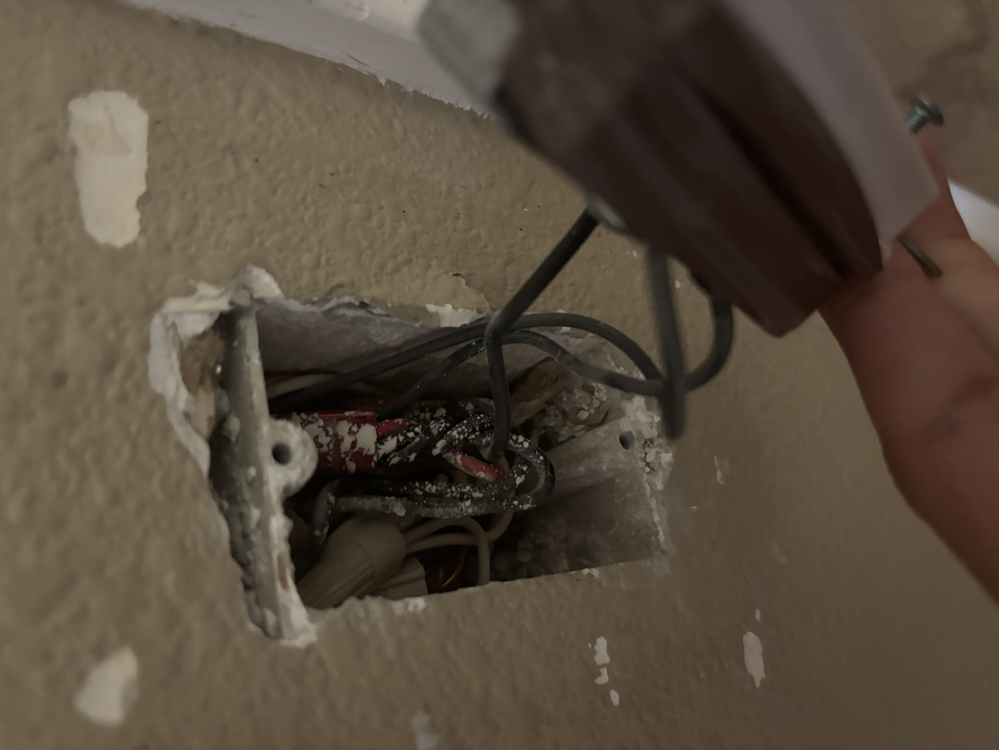
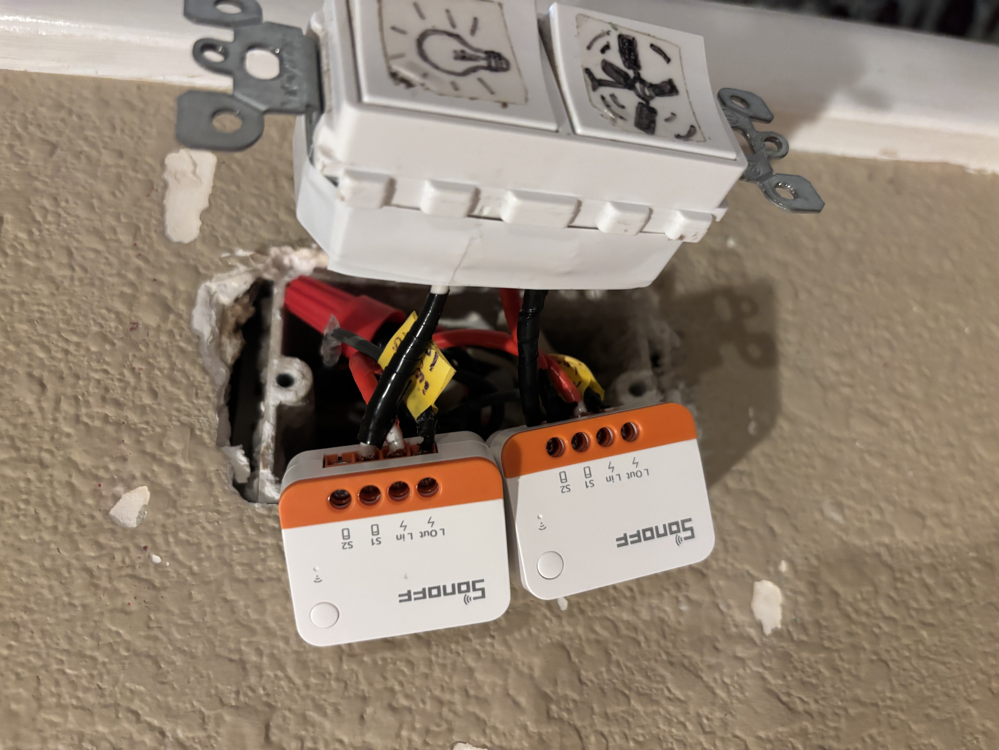
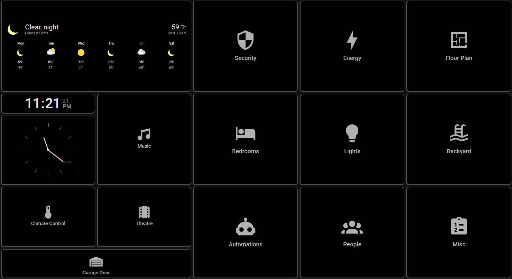

# Raspberry Pi Smart Home IoT System
## Overview
This project documents the design and deployment of a distributed smart home automation system built using a Raspberry Pi edge server running Home Assistant.

The system integrates 40+ IoT devices, including sensors, switches, cameras, thermostats, and media systems into a centralized automation system for monitoring, automation, and remote control.

The goal of the project was to build a reliable and scalable smart home system using Zigbee mesh networking, WiFi smart devices, and custom hardware integrations.

Note: Sensitive configuration files, security automations,
network settings, and access credentials are intentionally
excluded from this repository for security reasons.

## Zigbee Switch Installation

| Before | After |
|------|------|
|  |  |

## Garage Door Controller Hardware Modification

| Before | After |
|------|------|
|  |  |

## Raspberry Pi Hub and Kiosk

| Before | After |
|------|------|
|  |  |

## Dashboards

| Kiosk | Phone |
|------|------|
|  |  |

